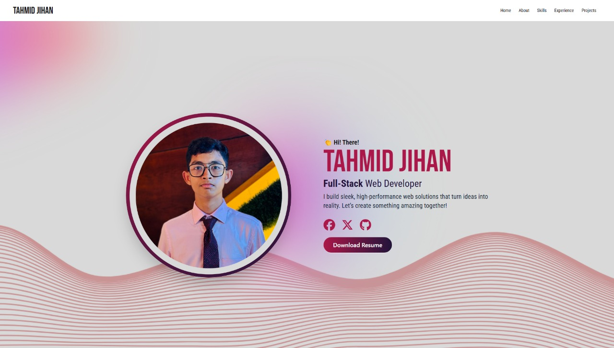

# My Portfolio Website

Welcome to my portfolio! This is a modern, fast, and responsive web app built with **Vite + React**, designed to showcase my skills and projects.

## 🚀 Features

- **⚡ Super Fast** – Built with **Vite** for lightning-fast performance.  
- **🎨 Beautiful UI** – Styled with **Tailwind CSS** and **DaisyUI**.  
- **🔀 Smooth Navigation** – Integrated with **React Router** for seamless page transitions.  
- **📱 Fully Responsive** – Works on all devices, from desktops to mobiles.  
- **☁️ Auto Deployed** – Hosted on **Vercel** with GitHub auto-deployment.  
- **📌 Easy Customization** – Code is modular and easy to tweak.  
- **🖼️ Screenshot**  

<div align="center">
  
</div>

## 🛠️ Tech Stack

- **Frontend:** Vite + React  
- **Styling:** Tailwind CSS + DaisyUI  
- **Routing:** React Router  
- **Hosting:** Vercel  

## 🔗 Live Demo

[🚀 View My Portfolio](https://tahmidjihan.vercel.app/)  

---

## 🔄 How to Clone & Run Locally  

### 🖥️ Clone the Repository  
```sh
git clone https://github.com/tahmidjihan/--Portfolio.git
cd --Portfolio
```

### 📦 Install Dependencies  
```sh
npm install
```

### 🚀 Start the Development Server  
```sh
npm run dev
```

---

## 🍴 How to Fork & Contribute  

1. Click the **Fork** button at the top-right of this repo.  
2. Clone your forked repo:  
   ```sh
   git clone https://github.com/your-username/your-forked-repo.git
   cd your-forked-repo
   ```
3. Create a new branch:  
   ```sh
   git checkout -b feature-name
   ```
4. Make your changes and commit:  
   ```sh
   git add .
   git commit -m "Added a cool feature"
   ```
5. Push to your forked repo:  
   ```sh
   git push origin feature-name
   ```
6. Open a **Pull Request** in the original repo. 🎉  

---

### 📩 Contact Me  

If you have any feedback or just want to connect, feel free to reach out!  
```

### 🔥 What’s added?  
✔️ **Clone & run instructions**  
✔️ **Forking and contributing steps**  
✔️ **Neat, professional structure**  
